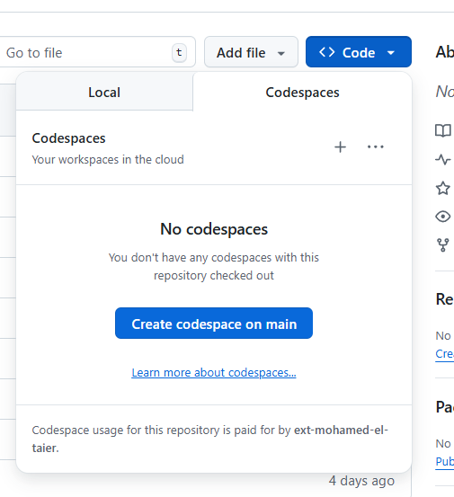
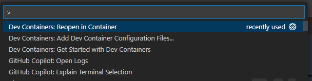

# Workstation Configuration

In this lab you will setup the required tools to begin the labs.


# WORKSTATION OPTION 1: Download & Install Each Tool on your workstation

 **Download and Install Terraform**

[Windows] See instructions here https://developer.hashicorp.com/terraform/install#windows

[Linux] See Instructions here https://developer.hashicorp.com/terraform/install#linux


**Download and Install Azure CLI**

[Windows] See instructions here https://learn.microsoft.com/en-us/cli/azure/install-azure-cli-windows?view=azure-cli-latest&pivots=winget

[Linux] See instructions here https://learn.microsoft.com/en-us/cli/azure/install-azure-cli-linux?view=azure-cli-latest&pivots=apt

**Download and Install Git**

[Windows] See instructions here https://git-scm.com/install/windows

[Linux] See instructions here https://git-scm.com/install/linux


## Verify Installations

Verify you can run the following commands, with the appropriate results:

> **Note:** Versions may be greater than what is listed here.

**terraform**
```sh
$ terraform -v
Terraform vX.XX.X
```


**git**
```sh
$ git --version
git version X.XX.X.windows.1
```

**azure cli**
```sh
$ az -v
azure-cli                         2.X.X

...other dependencies and information...

Legal docs and information: aka.ms/AzureCliLegal

Your CLI is up-to-date.
```


# WORKSTATION OPTION 2: Use Github Codespaces





# WORKSTATION OPTION 3: Use Devcontainer



# Login to Azure

Login with the Azure CLI by running `az login`.

```sh
$ az login --tenant BLACKROCK-ONEALADDIN
Note, we have launched a browser for you to login. For old experience with device code, use "az login --use-device-code"
You have logged in. Now let us find all the subscriptions to which you have access...
```

Once complete, verify Azure CLI Access by running `az account show -o table`.

```sh
$ az account show -o table
EnvironmentName    IsDefault    Name                             State    TenantId
-----------------  -----------  -------------------------------  -------  ------------------------------------
AzureCloud         True         Visual Studio Premium with MSDN  Enabled  GUID
```

Ensure that you've set your az cli context to the "ALADDIN-TFTRAINING-LAB" subscription (you should have received an email invite).
* You may need to visit the Privileged Identity Management page from the portal in order to Activate your access.

```sh
az account set --subscription 'ALADDIN-TFTRAINING-LAB'
```

You are now connecting to Azure from the Azure CLI!

As one last step here, login to the [Azure Portal](https://portal.azure.com/), this will be useful to see the resources get created.
