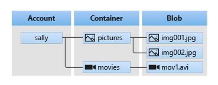
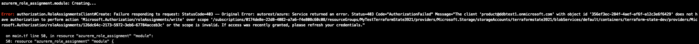

# Remote State

## Expected Outcome

You will understand what remote state is, why it's important when working with shared Terraform codebases, and how to store it in Azure.

## How To
You will create an Azure Storage Account to store Terraform state file(s) as a blob. Azure Blob storage has a hiearchy that is required in order to store blobs, as illustrated below:



For this lab, you'll choose one of the following access methods for remote state:
1. Access Key
1. [Role-Based Access Controls (RBAC)](https://docs.microsoft.com/en-us/azure/storage/blobs/authorize-access-azure-active-directory#azure-built-in-roles-for-blobs)

RBAC offers advantages to simplicity of management and configuration and usage, but requires the "Owner" role to the Storage Account. This is an elevated built-in role in Azure that you may or may not have. If that is the case, the Access Key can be used instead.

### Create Terraform Configuration
You will create a `main.tf` file with the following:
1. A `terraform {}` block declaring the version of Terraform to use as well as the `azurerm` provider within the `required_providers` block.
1. An `azurerm` block for the provider configuration.
1. A [Resource Group](https://registry.terraform.io/providers/hashicorp/azurerm/latest/docs/resources/resource_group). Make sure you use a unique Resource Group name, especially if using a shared subscription. We recommend using a variable each for the RG name and location!
1. Create an [azurerm_storage_account](https://registry.terraform.io/providers/hashicorp/azurerm/latest/docs/resources/storage_account) resource in your module's `main.tf` file. **NOTE** the name must be lowercase, no spaces.
1. Create an [azurerm_storage_container](https://registry.terraform.io/providers/hashicorp/azurerm/latest/docs/resources/storage_container) resource that is part of your storage account. **NOTE** the name must be lowercase, no spaces.
1. An `output` each for your Resource Group Name, Storage Account Name, and Container Name. These will be used later to configure your remote state backend.

### Use Access Key
> NOTE: only complete this section if you are NOT assigned the "Owner" role to the Subscription, Resource Group, or Storage Account).
1. Add a property to `azurerm_storage_account` to enable public access, e.g. `allow_blob_public_access = true`. **NOTE** this is NOT recommended for production environments!
1. Add an `output` with the value set to the [primary_access_key](https://registry.terraform.io/providers/hashicorp/azurerm/latest/docs/resources/storage_account#primary_access_key) of the `azurerm_storage_account`.
> NOTE: Treat the Access Key as a secret!

### Create Role Assignment
> NOTE: only complete this section if you are an "Owner" of the Subscription, Resource Group, or Storage Account
This Role Assignment is known as RBAC.
1. Create an [azurerm_role_assignment](https://registry.terraform.io/providers/hashicorp/azurerm/latest/docs/resources/role_assignment) resource in the module as well. This role assignment should contain the following:
    1. A scope set to the [Storage Account Container ID](https://registry.terraform.io/providers/hashicorp/azurerm/latest/docs/resources/storage_container#resource_manager_id)
    1. A principal id set to the current principal who is executing the Terraform (hint: see [azurerm_client_config Data Source](https://registry.terraform.io/providers/hashicorp/azurerm/latest/docs/data-sources/client_config)
    1. A role definition name set to `"Storage Blob Data Owner"` **NOTE** Storage Accounts support either Role Based Access Controls (RBAC) _or_ access keys. We're using RBAC here. This is set per Storage Account Container.

A typical error you would see when running Terraform with insufficient permissions to add RBAC would be on the `azurerm_role_assigment` resource, e.g.


If you see this error, please used the [Access Key](#Use-Access-Key) auth method configuration instead! You don't have permission to add RBAC role assignments. You may remove the `azurerm_role_assignment` resource block.

### Init, Plan, and Apply
1. Run the Terraform workflow to Plan and Apply your IaC configuration.
1. DO NOT destroy your infrastructure yet!

### Configure the Terraform Backend
1. We're going to use the storage account that you just deployed as a remote state backend. Open your `main.tf` and locate the `terraform` configuration block.
1. Add a nested block to the `terraform` configuration named `backend "azurerm" {}` and add the following properties (as strings):
  1. `resource_group_name`
  1. `storage_account_name`
  1. `container_name`
  1. `key` - this sets the name of the state file blob (it is created if it does not exist). Set this to a name of your choice, but use the extension ".tfstate". This is not required, but a convention.
  1. Your configuration will look something like:
  ```
  terraform {
    backend "azurerm" {
      resource_group_name  = "MyRGName"
      storage_account_name = "mystorageacct"
      container_name       = "terraformstate"
      key                  = "mystate.tfstate"
    }
  }
  ```
1. If you are using an Access Key to authenticate to your backend storage account [Access Key, above](#Use-Access-Key)
    1. Export an environment variable in your shell named `ARM_ACCESS_KEY` and set the value to the value of the access key you've output
    1. **OR** pass in [-backend-config](https://www.terraform.io/language/settings/backends/configuration#partial-configuration) parameters to `terraform init` during the next step, e.g. `terraform init -backend-config="access_key=xxxxxxxxxx"`.
1. Save `main.tf`, then run `terraform init` and follow the prompts to migrate your local state to the new backend:
    ```sh
    terraform init

    Initializing the backend...
    Do you want to copy existing state to the new backend?
      Pre-existing state was found while migrating the previous "local" backend to the
      newly configured "azurerm" backend. No existing state was found in the newly
      configured "azurerm" backend. Do you want to copy this state to the new "azurerm"
      backend? Enter "yes" to copy and "no" to start with an empty state.
    ```
    > NOTE: the shorthand for this that will suppress the prompt is `terraform init -force-copy`
    > NOTE: if you receive a permission or access error, please wait a few minutes and try again. RBAC permissions can take time to propagate!
1. Delete `terraform.tfstate` and `terraform.tfstate.backup` (if it exists). At this point, your statefile is stored in your Azure Storage Account as a Blob!
1. Login to the [Azure Portal](https://portal.azure.com) and locate the Resource Group, Storage Account, Container, and statefile (Blob), to verify your work.
1. Run another Terraform Plan/Apply workflow. You shouldn't see any changes, but note the backend output in stdout:
```sh
Successfully configured the backend "azurerm"! Terraform will automatically
use this backend unless the backend configuration changes.
```

### Carefully Tear Down
1. Your statefile is now stored in Azure, but what do we do if we want to destroy our state storage account cleanly? If we destroy it with remote state stored on it, we'll also destroy our statefile!
1. Run `terraform state pull > terraform.tfstate`... this will pull your remote statefile from the backend and save it into your current working directory as `terraform.tfstate`.
1. Remove the `backend "azurerm" {}` block from `main.tf`.
1. Run `terraform init` to reinitialize Terraform without the remote backend.
1. Destroy your infrastructure.

> On Azure, the [azurerm](https://www.terraform.io/language/settings/backends/azurerm) backend leverages Azure Storage Accounts to store the Terraform state as a blob. Please note that it is important to properly configure your Storage Account for snapshots, replication, and backup (as needed) as well as appropriate security controls to keep your state files secure!

## Questions
1. Why would you want to store your Terraform state using a remote backend?
1. How does Terraform authenticate to the backend storage account when you run plan and apply?
1. Why did we assign the role to the container and not the storage account?
1. How would you secure your remote state in Azure?
1. Why is it important to secure and replicate remote state?

## Resources
- [Remote State Backend](https://www.terraform.io/language/state/remote)
- [azurerm backend](https://www.terraform.io/language/settings/backends/azurerm)
- [azurerm_storage_container](https://registry.terraform.io/providers/hashicorp/azurerm/latest/docs/resources/storage_container) 
- [azurerm_storage_account](https://registry.terraform.io/providers/hashicorp/azurerm/latest/docs/resources/storage_account)
- [azurerm_role_assignment](https://registry.terraform.io/providers/hashicorp/azurerm/latest/docs/resources/role_assignment)
- [Azure built-in Roles for Blobs](https://docs.microsoft.com/en-us/azure/storage/blobs/authorize-access-azure-active-directory#azure-built-in-roles-for-blobs)
- [Account Shared Access Signature (SAS) key](https://docs.microsoft.com/en-us/rest/api/storageservices/create-account-sas)
- [azurerm_client_config](https://registry.terraform.io/providers/hashicorp/azurerm/latest/docs/data-sources/client_config)
